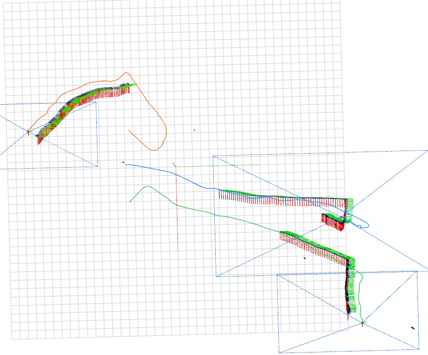

The following cases are tested with the latest code in rotors_simulator (`xiaofan`) and drone-fl (`main`).

None of the three cases work completely on my end now. It would be nice if you could make sure they all work with your new planner.


### How to run Case 1 using frozen model and ground-truth for planning

Terminal 1:

```bash
cd /home/wyw/Code/xiaofan_ws
source devel/setup.bash
roslaunch rotors_gazebo mav_swarm_0.launch
```

Terminal 2:

```bash
cd /home/wyw/Code/xiaofan_ws
source devel/setup.bash
roslaunch rotors_gazebo multi_drone_0.launch
```

Terminal 3:

```bash
cd /home/wyw/Code/xiaofan_ws/drone-fl/planner/script
python3 tracker_server.py --exp_name exp0
```

On my end, the issue is: all cars will stop after a certain number of steps. The inference model (`multi_drone_0.launch`) and planning ('tracker_server.py') seems to work as normal after the stop.

I suspect that this is because there is a "area restriction" somewhere in the code. I observed that both car and scarab targets are constrained within a limited area, and when they hit the boundary, they will stop moving, as shown below:




### How to run Case 2 using frozen model and ground-truth for planning

Terminal 1:

```bash
cd /home/wyw/Code/xiaofan_ws
source devel/setup.bash
roslaunch rotors_gazebo mav_swarm_1.launch
```

Terminal 2:

```bash
cd /home/wyw/Code/xiaofan_ws
source devel/setup.bash
roslaunch rotors_gazebo multi_drone_1.launch
```

Terminal 3:

```bash
cd /home/wyw/Code/xiaofan_ws/drone-fl/planner/script
python3 tracker_server.py --exp_name exp1
```

On my end, the issue is: One of the drone will not "fly up", remaining lying on the ground.


### How to run Case 3 using frozen model and ground-truth for planning

Terminal 1:

```bash
cd /home/wyw/Code/xiaofan_ws
source devel/setup.bash
roslaunch rotors_gazebo mav_swarm_2.launch
```

Terminal 2:

```bash
cd /home/wyw/Code/xiaofan_ws
source devel/setup.bash
roslaunch rotors_gazebo multi_drone_2.launch
```

Terminal 3:

```bash
cd /home/wyw/Code/xiaofan_ws/drone-fl/planner/script
python3 tracker_server.py --exp_name exp2
```

On my end, the issue is: Target 4-6 do not move after the start.